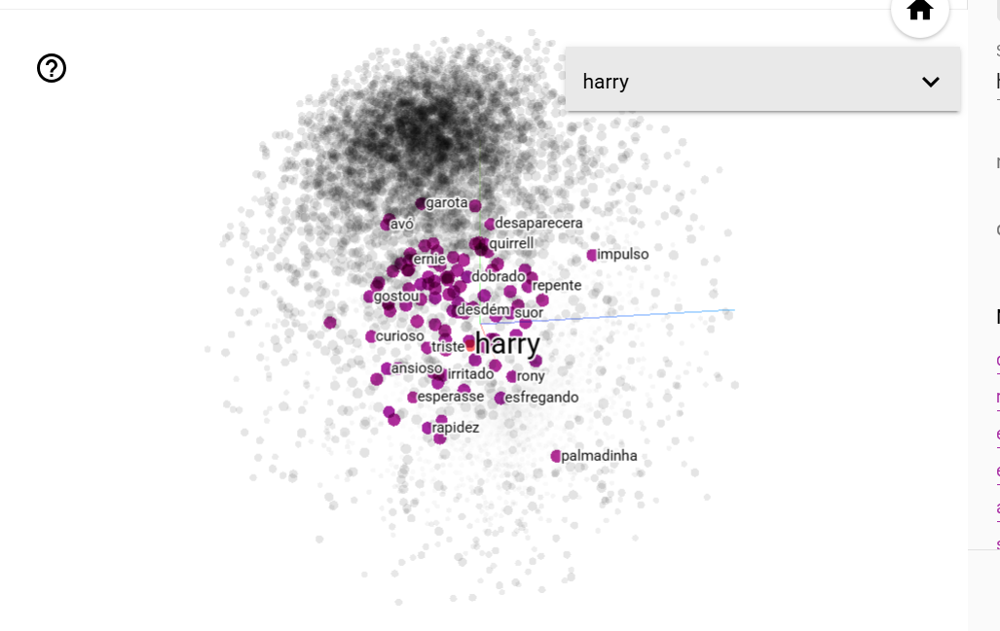
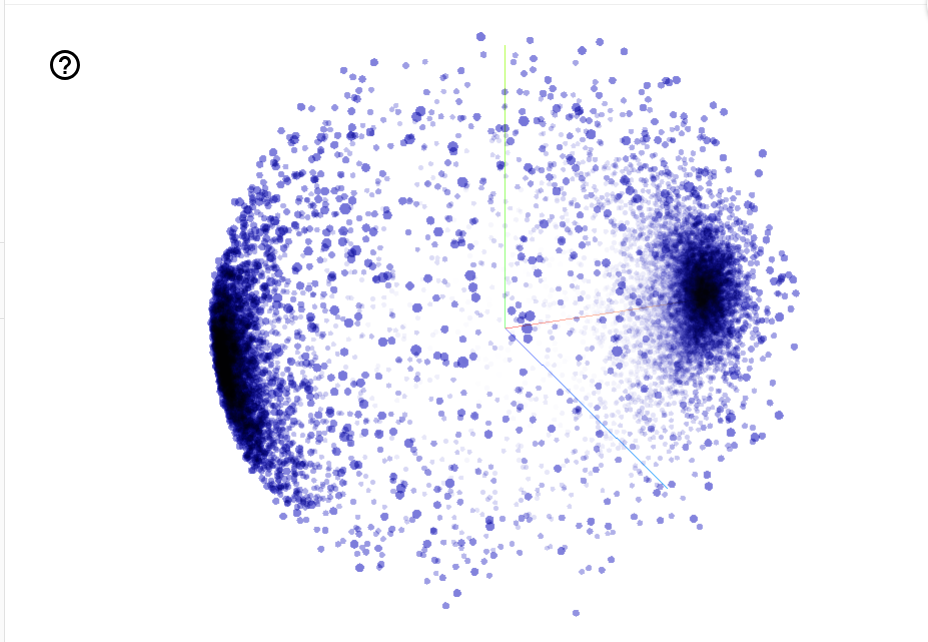

# Harry Potter com Word2Vec

Este projeto utiliza Processamento de Linguagem Natural (NLP) para analisar e mapear os dois primeiros livros da saga Harry Potter ("A Pedra Filosofal" e "A Câmara Secreta" - edições PT-BR). O objetivo é entender como a Inteligência Artificial interpreta relações literárias, personagens e contextos através de embeddings de palavras.

## Tecnologias Utilizadas
* **Python**
* **spaCy** (`pt_core_news_lg`): Para tokenização, filtragem de stop words e processamento textual.
* **Gensim** (`Word2Vec`): Para a criação e treino do modelo de embeddings.
* **TensorFlow Embedding Projector**: Para a visualização 3D da "galáxia" de palavras.

---

## Pipeline e Pré-processamento

A limpeza dos textos foi feita com a biblioteca spaCy. 

1. **Remoção de Pontuação e Espaços:** `is_punct` e `is_space`.
2. **Filtro de Stop Words:** Remoção de palavras estruturais sem peso semântico (usando a lista nativa do spaCy).
3. **Padronização:** Todas as palavras foram convertidas para minúsculas (`.lower()`).
4. **Decisão de Design (Manutenção de Verbos):** Diferente de pipelines puramente focados em entidades, os verbos e adjetivos foram mantidos intencionalmente para capturar o comportamento e as interações narrativas dos personagens (ex: associar "Harry" a palavras de ação e sentimentos).

No total, foram extraídas mais de **12.480 frases limpas** para o treino.

---
## Experimentação e Sintonia de Parâmetros (Hyperparameter Tuning)

Durante o desenvolvimento, a IA foi testada com diferentes níveis de "intensidade" para entender como o Word2Vec reage. A variação dos parâmetros gerou insights valiosos sobre como o modelo mapeia a linguagem:

### 1. Janela de Contexto (`window`)
* **Teste com `window=5`:** O modelo focou estritamente na gramática e na sintaxe imediata. Ele aprendeu que nomes próprios costumam ser seguidos de verbos (ex: "Harry sacudiu", "Dumbledore perguntou").
* **Teste com `window=20`:** Ao aumentar a janela para 20 palavras, o modelo parou de olhar para a gramática e passou a focar em **Tópicos Semânticos**. Palavras do mesmo núcleo começaram a orbitar juntas independentemente da ordem na frase (ex: "vassoura", "pomo", "goles" e "apanhador" se agruparam no tópico *Quadribol*).

### 2. Épocas de Treinamento (`epochs`)
* **Teste com `epochs=5`:** Sendo um corpus pequeno (apenas dois livros), 5 leituras não foram suficientes para consolidar as relações secundárias dos personagens de fundo.

* **`epochs=20`:** O modelo leu o texto vezes suficientes para aprender as relações complexas (como a inimizade de Snape e Harry), mas sem decorar.

### 3. Frequência Mínima (`min_count=1`)
*  `min_count=5` para ignorar erros de digitação e garantir que feitiços raros e personagens secundários que aparecem poucas vezes não fossem apagados da memória.

### 4. O Impacto do POS Tagging (O Filtro de Verbos)
Foi realizado um teste comparativo utilizando filtrando as classes gramaticais:
* **Com Verbos:** O modelo agrupa os personagens pelas suas ações (protagonistas ficam próximos de verbos de movimento e emoção).
* **Sem Verbos (`if palavra.pos_ != "VERB"`):** É criado um mapa mais restrito de entidades, objetos e características (adjetivos), revelando melhor a relação entre as casas de Hogwarts e seus membros.
* **Decisão Final:** Optou-se por manter o texto com verbos, permitindo que a IA compreendesse a ação narrativa.

## Configurações do Modelo (Gensim)

O modelo foi treinado com uma configuração focada em aprender contextos médios/amplos após várias leituras do texto:

```python
Word2Vec(sentences, vector_size=100, window=5, min_count=1, sg=0, epochs=20, workers=3)
```

1. Dimensões (vector_size=100): Cada palavra é representada por um vetor de 100 números.

2. Janela (window=5): Análise de 5 palavras vizinhas.

3. Treino (epochs=20): O modelo leu o conjunto de dados 20 vezes para fixar relações estruturais em um corpus considerado pequeno (2 livros).

## Resultados e Testes de Sanidade
A avaliação do modelo foi feita através de similaridade de cossenos e matemática de vetores. O modelo obteve resultados fascinantes, capturando nuances da escrita de J.K. Rowling.

1. Associações Diretas:
Devido à manutenção dos verbos e adjetivos, pesquisar pelo protagonista reflete diretamente a sua experiência narrativa no texto:

    most_similar("harry") -> ('distraído', 0.90), ('encarando-o', 0.89), ('sacudiu-a', 0.88).

    most_similar("dumbledore") -> O modelo associou o diretor a palavras que indicam tom de voz ou interlocutores chave: ('perguntei', 0.94), ('brandura', 0.94), ('tom', 0.93), ('riddle', 0.93).

2. O Teste do Intruso (doesnt_match)

    ['harry', 'hermione', 'snape'] -> Intruso identificado: Hermione (Harry e Snape interagem muito entre si sob a mesma dinâmica de conflito).

    ['harry', 'rony', 'dursley', 'neville'] -> Intruso identificado: Dursley (O único não-bruxo/não-aluno do grupo).

3. Matemática de Palavras (Embeddings Mágicos)
Ao somar características dos protagonistas e subtrair a essência de um professor antagonista:

    Cálculo: positive=['harry', 'hermione'], negative=['snape']

    Resultado Nº 1: rony (Score: 0.87)

## Visualização 3D
Para a visualização do modelo, foi utilizado um gerador em Python via io para extrair os dicionários diretamente da memória e gerar os arquivos .tsv com perfeição.

A nuvem de palavras pode ser explorada interativamente subindo os arquivos _tensor.tsv e _metadata.tsv no TensorFlow Embedding Projector.


